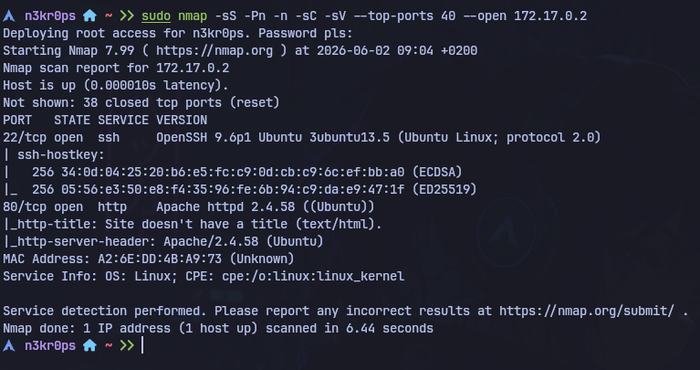
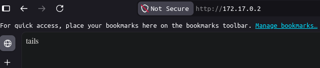
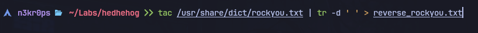
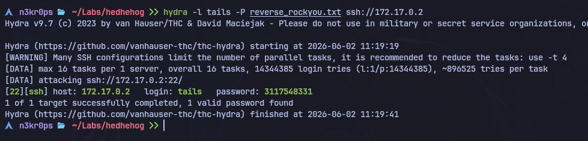
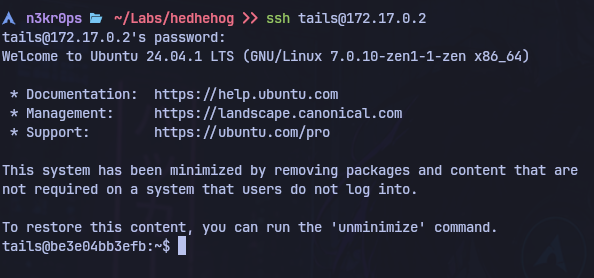
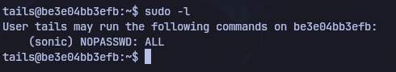
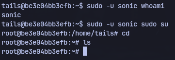

# WriteUp - HedgeHog

**Objetivos**
- Ganar acceso a la máquina por SSH.
- Escalada de privilegios.

---

## 🔎 Reconocimiento
Se usa `nmap -sS -Pn -n -sC -sV --top-ports 40 --open 172.17.0.2`

> [!TIP]
> Se usan parámetros para mejorar el sigilo, descubrimiento de versiones y servicios y para evitar el ping y la resolución de DNS. También se emplean los 40 puertos más comunes y que solo reporte los abiertos.



Se obtienen datos sobre servicios `SSH` y `HTTP` en los puertos `22` y `80` respectivamente.

**Acceso a la web**

Usando la información obtenida por nmap, se accede a la web, dónde figura una palabra `tails`.



> [!NOTE]
> Se intuye que `tails` puede referirse al nombre de usuario del servicio SSH.

---

## 💣 Explotación
Con la información recogida, se utiliza hydra para tratar de averiguar la contraseña de `tails` por fuerza bruta.

```bash
hydra -l tails -P /usr/share/dict/rockyou.txt ssh://172.17.0.2
```
> [!NOTE]
> Se observa que el escaneo se demora demasiado. Dado que el usuario es `tails` se intuye que podría tener algo que ver con el final del archivo, por lo que se prueba a invertir el `rockyou.txt`.

> [!IMPORTANT]
> Al principio se invierte con `tac /usr/share/dict/rockyou.txt > reverse_rockyou.txt` pero se observan espacios vacíos en algunas contraseñas, por lo que se emplea.
> `tac /usr/share/dict/rockyou.txt | tr -d ' ' > reverse_rockyou.txt`



Se lanza nuevamente hydra, pero esta vez con el diccionario invertido.



Con esto se obtiene la contraseña `3117548331` para el usuario `tails`.

---

## 🔑 Acceso y Escalada de privilegios
Usamos las credenciales obtenidas para tratar de acceder por SSH a la máquina.



Se obtiene acceso como `tails`. Inmediatamente después se usa un `sudo -l` para comprobar si existen binarios que se puedan ejectuar como `root` sin contraseña.



Se averigua que `tails` no puede hacerlo, pero el usuario `sonic` si. Se busca información sobre como usar `sudo -u` correctamente y se intenta realizar una escalada de la siguiente forma.



Gracias a esta última ejecución se consigue acceso a la máquina como `root`.

> [!TIP]
> Se investiga también el usuario `sonic` y se descubre un archivo dentro de documentos con la contraseña del mismo.

---

## 🗒️ Lecciones aprendidas
